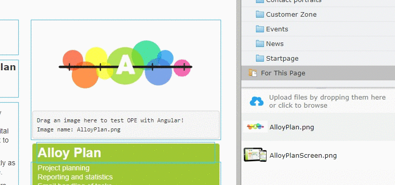

# On-Page Edit examples in Alloy using AngularJS (v1.x)

Example site for showing how to use On-Page Edit together with AngularJS. Please help out by contributing more examples through PR's!

_Note: You'll need CMS UI >=10.12.0 and while this is in Beta you [need to enable the features](https://world.episerver.com/blogs/Fredrik-Tjarnberg/Dates/2014/9/Releasing-Beta-Features/)._

## Site login
User: cmsadmin

Password: sparr0wHawk!

## Examples

### Image property used in a nested HTML element 

Interesting files:
* Controllers/ImageFileController.cs
* Static/angularjs/ProductPageController.js
* Views/ProductPage/Index.cshtml
